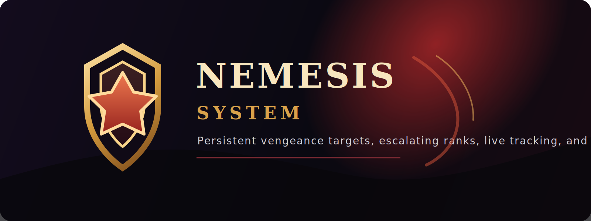
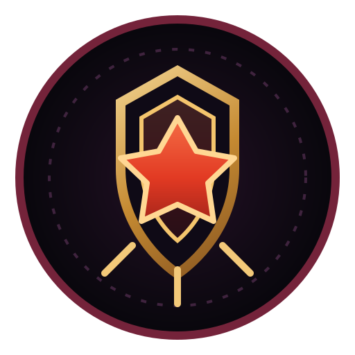
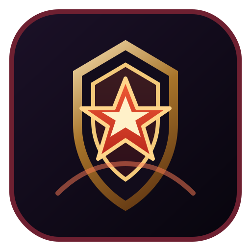
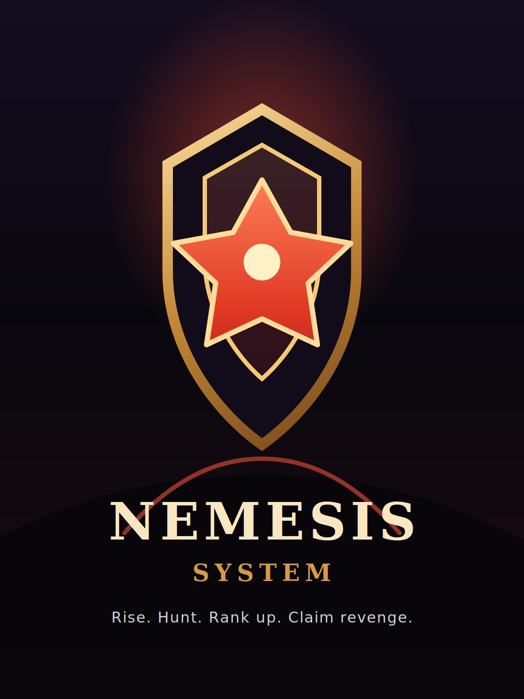

# Nemesis System Module

## Overview

`mod-nemesis-system` turns selected open-world PvE deaths into persistent revenge targets.
When an eligible creature kills a player, the creature is promoted into a Nemesis,
gains rank-based scaling, and is persisted in the characters database so the state
survives creature unloads and server restarts.

Optional City Siege integration can also promote active siege attackers and defenders
after they kill a real player. Because siege creatures are temporary summons, those
siege-created nemeses are runtime-only and are cleared when the creature dies or despawns.
The module now auto-detects City Siege support at compile time, so it can be built
and installed cleanly whether `mod-city-siege` is present or not.

This scaffold implements the first vertical slice:

- player-death trigger using `OnPlayerKilledByCreature`
- persistent `character_nemesis` storage in the characters database
- rank-based size, health, and melee/ranged damage scaling
- affix rolling with runtime behavior hooks
- configurable rank-based visual aura support for active nemeses
- re-application on `OnCreatureAddWorld`
- cleanup when a tracked nemesis dies
- decay for stale nemesis records
- direct revenge and bounty rewards on kill
- GM commands for testing and state control
- configurable announcements for creation, rank-up, and kill events
- anti-feed cooldowns for repeated promotions and same-victim farming
- initial companion addon transport and client scaffold for live nemesis tracking

## Files

- `src/NemesisSystem.cpp`: initial gameplay and persistence logic
- `src/nemesis_system_loader.cpp`: module loader entrypoint
- `conf/mod_nemesis_system.conf.dist`: module configuration
- `data/sql/db-characters/base/nemesis_system.sql`: characters database schema
- `doc/companion-addon-spec.md`: companion addon design and message contract
- `ClientAddon/NemesisTracker/`: WoW 3.3.5a addon scaffold

## Installation

1. Build AzerothCore with the module enabled.
2. Import `data/sql/db-characters/base/nemesis_system.sql` into the characters database.
   - Existing installs should also apply `data/sql/db-characters/updates/2026_03_22_00_nemesis_last_seen.sql`.
3. Copy `conf/mod_nemesis_system.conf.dist` to your server config directory if needed.
4. Restart `worldserver`.

## Current Behavior

- Nemeses only spawn from non-instance, non-battleground, non-raid kills.
- Only DB-backed creature spawns are eligible.
- Critters, pets, dungeon bosses, world bosses, and sanctuary deaths are excluded.
- Creature eligibility is configurable by absolute creature level, rank type, and player-versus-creature level windows.
- Initial ranks affect size, health, and weapon damage.
- Rank 1 rolls one affix. Rank 3+ rolls a second affix.
- Implemented affixes: `Vampiric`, `Swift`, `Juggernaut`, `Savage`, `Spellward`, `Enraged`, `Regenerating`.
- Rank 5+ rolls a third affix.
- Active nemeses also carry a configurable rank-based visual aura by default.

Additional affix behavior:

- `Enraged`: gains bonus damage below a configurable health threshold.
- `Regenerating`: restores health periodically while damaged.
- The original victim is stored as the current nemesis target.
- Base creature stats are persisted so scaling stays stable across restarts and reloads.

## Eligibility Config

- `NemesisSystem.MinCreatureLevel`
- `NemesisSystem.MaxCreatureLevel`
- `NemesisSystem.AllowNormal`
- `NemesisSystem.AllowElite`
- `NemesisSystem.AllowRare`
- `NemesisSystem.AllowRareElite`
- `NemesisSystem.AllowWorldBoss`
- `NemesisSystem.PromotionLevelDiffMax`
- `NemesisSystem.TrivialKillLevelDelta`
- `NemesisSystem.CitySiegeIntegration.Enable`
- `NemesisSystem.CitySiegeIntegration.Chance`
- `NemesisSystem.VisualAuraSpell`
- `NemesisSystem.VisualAuraSpellRank1`
- `NemesisSystem.VisualAuraSpellRank2`
- `NemesisSystem.VisualAuraSpellRank3`
- `NemesisSystem.VisualAuraSpellRank4`
- `NemesisSystem.VisualAuraSpellRank5`

Default visual ladder:

- Rank 1: shield visual level 1
- Rank 2: shield visual level 2
- Rank 3: shield visual level 3
- Rank 4: static lightning visual
- Rank 5+: Thaddius lightning visual

## Anti-Feed Config

- `NemesisSystem.RankUpCooldownSeconds`
- `NemesisSystem.SameVictimCooldownSeconds`

Anti-feed cooldown state is now persisted with each nemesis record, so cooldowns survive server restarts.

## Rewards

- Revenge reward: granted when the original nemesis target or a member of their party kills the nemesis.
- Bounty reward: granted to other players who kill the nemesis.
- Rewards are configurable as direct item and gold grants.
- Item and gold rewards scale upward by nemesis rank.
- Rewards are granted to every eligible nearby party member, using AzerothCore's group reward distance.
- Reward scaling is based on the highest level among eligible nearby recipients.
- Overleveled kills scale rewards down linearly to zero.
- Underdog kills scale rewards up linearly to a configurable maximum multiplier.
- Gold scales directly, while item rewards are converted into chance-based rolls.

Announcement behavior:

- Create, rank-up, and kill announcements are sent to the nemesis creature's current zone.
- Rank-up announcements are promoted to server-wide only when a nemesis reaches rank 5.
- Announcement text includes nemesis location coordinates.

Reward scaling config:

- `NemesisSystem.RewardOverlevelDiffMax`
- `NemesisSystem.RewardUnderlevelDiffMax`
- `NemesisSystem.RewardUnderdogMaxMultiplier`

## GM Commands

- `.nemesis debug`: inspect the selected creature
- `.nemesis info <spawnId>`: inspect a nemesis directly by spawn id
- `.nemesis mark [rank]`: create or set a nemesis on the selected creature
- `.nemesis reroll`: reroll affixes on the selected nemesis
- `.nemesis list`: list active nemeses on the current map
- `.nemesis clear`: clear the selected creature's nemesis state
- `.nemesis mapclear`: clear all active nemeses on the current map
- `.nemesis clearall`: clear all stored nemesis records
- `.nemesis reload`: reload module config

## Companion Addon

The module now includes an initial WoW 3.3.5a client addon scaffold under:

- `ClientAddon/NemesisTracker/`

Copy that folder into the game client's `Interface/AddOns/` directory.

Current addon/server bridge behavior:

- `.nemesis addon bootstrap`: player-safe command that sends a filtered addon bootstrap containing recent, relation-matched, and rank 5 nemeses.
- `.nemesis addon report <spawnId>`: player-safe command used by the addon to submit a validated local sighting for a known nemesis.
- `.nemesis addon sync`: GM-only command that sends the full active nemesis snapshot for debugging.
- Server payload prefix: `Nemesis`
- Server payload families currently implemented:
  - `V2:HELLO`
  - `V2:BOOTSTRAP_BEGIN`
  - `V2:BOOTSTRAP_ENTRY`
  - `V2:BOOTSTRAP_END`
  - `V2:RANK5_BROADCAST`
  - `V2:UPSERT_VALIDATED`
  - `V2:REMOVE`
  - `V2:CHUNK`

Current addon scaffold behavior:

- standalone movable/resizable tracker window
- live nemesis list with relation-aware sorting
- AceDB-backed local nemesis cache used as the addon's working dataset
- stale fading and hiding based on last-seen timestamps
- basic detail panel
- zoomable and pannable placeholder map canvas
- filtered bootstrap ingest, chunk reassembly, peer sync, and validated upsert/remove handling
- waypoint fallback that prints selected nemesis coordinates to chat
- peer sync over addon comms for sharing validated sightings with guild, party, raid, or public channel scopes

Current addon location model:

- reaching rank 5 broadcasts a rounded last-known location realm-wide
- recent and relation-matched nemeses are restored via filtered bootstrap instead of full snapshot reloads
- lower-rank location refresh is driven by validated local sightings and addon-to-addon sharing
- local addon cache persists across sessions via AceDB and merges entries by timestamp

Current limitations:

- the client map is still a placeholder plotting surface rather than a real zone-texture map
- no dedicated waypoint addon integration yet
- public-channel peer sync still depends on players already being in the configured channel
- no compile or in-client runtime verification has been completed yet for this addon bridge

## Next Steps

1. Add additional affixes and spell-driven visuals.
2. Add richer reward presentation and optional reward messaging.
3. Integrate with optional autobalance hooks.

## Branding Assets

